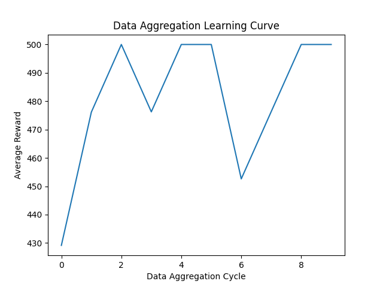

# CartPole Imitation Learning

This project is an Imitation Learning project for the classic CartPole situation.
I built it to better understand research surrounding imitation learning.

There both a simple Behavior Cloning model and a Dataset Aggregation (DAgger) model are implemented in this project. The Dataset Aggregation is able to produce more accurate results, as, unlike the Behavior Cloning model, it takes what the expert model would do as another piece of data to help it create a decision.

In default conditions, the Behavioral Clone model's reward was 109/500, whereas the Dataset Aggregation model had 500/500. In harder conditions, with a range of -0.2 to 0.2 for the environment, the Behavioral Clone got around 195/500, and the Dataset Aggregation model still had 500/500. However, in the extreme situation where the environment's range became -1 to 1, there was not such a stark difference between the two models; the Behavioral Clone had a reward of 13.5/500, whereas the Dataset Aggregation model had a reward of 25.95/500.
Yet, the Dataset Aggregation model was not completely accurate all the time:

To run this code, clone the repository. Change file paths in the files dataset_aggregation.py and cloning_training.py. Download dependencies: pip install gymnasium torch numpy matplotlib stable-baselines3. Run collect_expert_data.py first, then cloning_training.py. Then, run dataset_aggregation.py. Finally, run evaluate.py and evaluate_bc.py.
